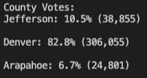
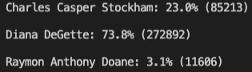
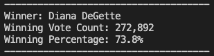
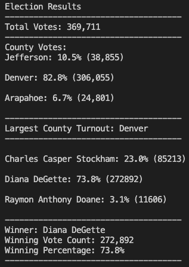

# Election Analysis

## <u>Project Overview</u>
The project consisted in assisting the Colorado Board of Elections by completing an audit of election data. The following information was analyzed using python and delivered as a Text file:

1. Calculation of total number of votes cast
2. A complete list of candidates who received votes
3. The total number of votes each candidate received
4. The percentage of votes each candidate received
4. The winner of the election based on popular vote

## <u>Election-Audit Results:</u>

-   How many votes were cast in this congressional election? 

    <em>There were 369,711 votes casted.</em>
-   Provide a breakdown of the number of votes and the percentage of total votes for each county in the precinct.

    
-   Which county had the largest number of votes?

    <em>Denver had the largest number of votes, 306,055 votes casted</em>
-   Provide a breakdown of the number of votes and the percentage of the total votes each candidate received.

    
-   Which candidate won the election, what was their vote count, and what was their percentage of the total votes?

    

## <u>Election-Audit Summary</u>

## <u>Resources:</u>
Data Source: 
- election_results.csv

Software: 
- Python 3.8.8
- Visual Studio Code 1.61.1 (Universal)

[Python String Formatting](https://thepythonguru.com/python-string-formatting/)

